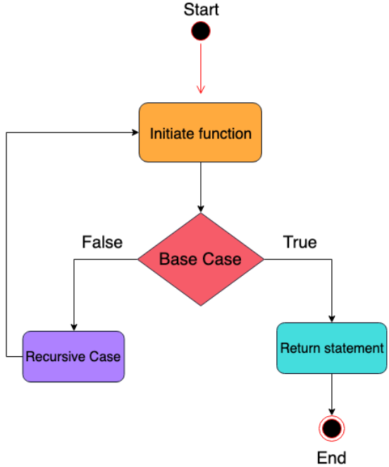

# Recursion
### Definition
Recursion is the process of describing an action in terms of itself.
Recursion occurs when a function calls itself repeatedly until it reaches 
a pre-defined stopping condition.
### Reason to use Recursion 
- Recursive code is generally shorter and easier to write than iterative code.
- Recursion is most useful for tasks that can be defined in terms of similar subtasks.
### Structure
- **Base Case:** where all further calls to the same function stop, meaning that it does not make any subsequent recursive calls.
- **Recursive case:** where the function calls itself repeatedly until it reaches the base case.
  
### Syntax
```
def RecursiveFunction() :
  # Base Case
  if <baseCaseCondition> :
    <return some base case value>

  # Recursive Case
  else :
    <return(recursive call and any other task)>
```

